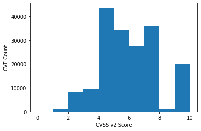
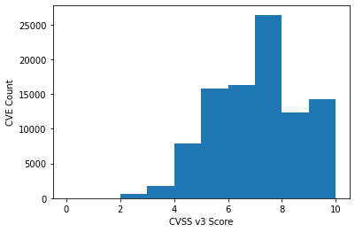
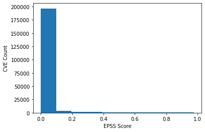
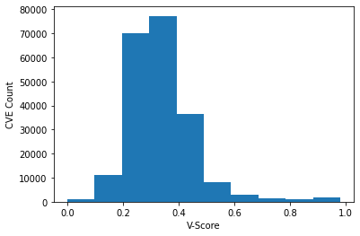
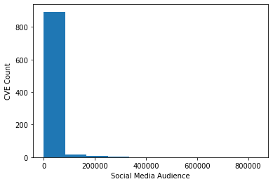

# Histogram
Build out histrograms to count distributions of scores for comparison. Notice how CVSS is heavily weight towards alerting critical CVEs. This becomes overwhelming and evidence shows that distributions that have less criticals to prioritise improves remediation efforts.


```python
import json

# Opening JSON file
f = open('../data/cve.json')
 
# returns JSON object as
# a dictionary
data = json.load(f)
 
# Iterating through the json list and populate histograms
x_vendor_count = {}
x_cvssv2 = []
x_cvssv3 = []
x_epss = []
x_vscore = []
x_social_media = []
for i in data['cves']:
    if i['cvssv2'] is not None:
        x_cvssv2.append(i['cvssv2'])
    if i['cvssv3'] is not None:
        x_cvssv3.append(i['cvssv3'])
    if i['epss'] is not None:
        x_epss.append(i['epss'])
    if i['v-score'] is not None:
        x_vscore.append(i['v-score'])
    if i['social_media_audience'] is not None:
        x_social_media.append(i['social_media_audience'])
    if i['vendors'] is not None:
        for ven in i['vendors']:
            if ven in x_vendor_count:
                x_vendor_count[ven] += 1
            else:
                x_vendor_count[ven] = 0

plt.hist(x_cvssv2)
plt.xlabel("CVSS v2 Score")
plt.ylabel("CVE Count")
plt.show()

plt.hist(x_cvssv3)
plt.xlabel("CVSS v3 Score")
plt.ylabel("CVE Count")
plt.show()

plt.hist(x_epss)
plt.xlabel("EPSS Score")
plt.ylabel("CVE Count")
plt.show()

plt.hist(x_vscore)
plt.xlabel("V-Score")
plt.ylabel("CVE Count")
plt.show()

plt.hist(x_social_media)
plt.xlabel("Social Media Audience")
plt.ylabel("CVE Count")
plt.show()

# Closing file
f.close()
```


    

    


    

    


    

    


    

    


    

    


# Bubble Charts

Some bubble charts for visualising quantities effecting things like number of vulnerabilities per vendor.


```python
import numpy as np
import matplotlib.pyplot as plt

cve_vendor_count = {
    'vendor': [],
    'count': [],
    'color': []
}

for ven in x_vendor_count:
    if x_vendor_count[ven] > 2000:
        cve_vendor_count['vendor'].append(ven)
        cve_vendor_count['count'].append(x_vendor_count[ven])
        import random
        color = "#%06x" % random.randint(0, 0xFFFFFF)
        cve_vendor_count['color'].append(color)


"""
Following function taken from : https://matplotlib.org/stable/gallery/misc/packed_bubbles.html
"""
class BubbleChart:
    def __init__(self, area, bubble_spacing=0):
        """
        Setup for bubble collapse.

        Parameters
        ----------
        area : array-like
            Area of the bubbles.
        bubble_spacing : float, default: 0
            Minimal spacing between bubbles after collapsing.

        Notes
        -----
        If "area" is sorted, the results might look weird.
        """
        area = np.asarray(area)
        r = np.sqrt(area / np.pi)

        self.bubble_spacing = bubble_spacing
        self.bubbles = np.ones((len(area), 4))
        self.bubbles[:, 2] = r
        self.bubbles[:, 3] = area
        self.maxstep = 2 * self.bubbles[:, 2].max() + self.bubble_spacing
        self.step_dist = self.maxstep / 2

        # calculate initial grid layout for bubbles
        length = np.ceil(np.sqrt(len(self.bubbles)))
        grid = np.arange(length) * self.maxstep
        gx, gy = np.meshgrid(grid, grid)
        self.bubbles[:, 0] = gx.flatten()[:len(self.bubbles)]
        self.bubbles[:, 1] = gy.flatten()[:len(self.bubbles)]

        self.com = self.center_of_mass()

    def center_of_mass(self):
        return np.average(
            self.bubbles[:, :2], axis=0, weights=self.bubbles[:, 3]
        )

    def center_distance(self, bubble, bubbles):
        return np.hypot(bubble[0] - bubbles[:, 0],
                        bubble[1] - bubbles[:, 1])

    def outline_distance(self, bubble, bubbles):
        center_distance = self.center_distance(bubble, bubbles)
        return center_distance - bubble[2] - \
            bubbles[:, 2] - self.bubble_spacing

    def check_collisions(self, bubble, bubbles):
        distance = self.outline_distance(bubble, bubbles)
        return len(distance[distance < 0])

    def collides_with(self, bubble, bubbles):
        distance = self.outline_distance(bubble, bubbles)
        idx_min = np.argmin(distance)
        return idx_min if type(idx_min) == np.ndarray else [idx_min]

    def collapse(self, n_iterations=50):
        """
        Move bubbles to the center of mass.

        Parameters
        ----------
        n_iterations : int, default: 50
            Number of moves to perform.
        """
        for _i in range(n_iterations):
            moves = 0
            for i in range(len(self.bubbles)):
                rest_bub = np.delete(self.bubbles, i, 0)
                # try to move directly towards the center of mass
                # direction vector from bubble to the center of mass
                dir_vec = self.com - self.bubbles[i, :2]

                # shorten direction vector to have length of 1
                dir_vec = dir_vec / np.sqrt(dir_vec.dot(dir_vec))

                # calculate new bubble position
                new_point = self.bubbles[i, :2] + dir_vec * self.step_dist
                new_bubble = np.append(new_point, self.bubbles[i, 2:4])

                # check whether new bubble collides with other bubbles
                if not self.check_collisions(new_bubble, rest_bub):
                    self.bubbles[i, :] = new_bubble
                    self.com = self.center_of_mass()
                    moves += 1
                else:
                    # try to move around a bubble that you collide with
                    # find colliding bubble
                    for colliding in self.collides_with(new_bubble, rest_bub):
                        # calculate direction vector
                        dir_vec = rest_bub[colliding, :2] - self.bubbles[i, :2]
                        dir_vec = dir_vec / np.sqrt(dir_vec.dot(dir_vec))
                        # calculate orthogonal vector
                        orth = np.array([dir_vec[1], -dir_vec[0]])
                        # test which direction to go
                        new_point1 = (self.bubbles[i, :2] + orth *
                                      self.step_dist)
                        new_point2 = (self.bubbles[i, :2] - orth *
                                      self.step_dist)
                        dist1 = self.center_distance(
                            self.com, np.array([new_point1]))
                        dist2 = self.center_distance(
                            self.com, np.array([new_point2]))
                        new_point = new_point1 if dist1 < dist2 else new_point2
                        new_bubble = np.append(new_point, self.bubbles[i, 2:4])
                        if not self.check_collisions(new_bubble, rest_bub):
                            self.bubbles[i, :] = new_bubble
                            self.com = self.center_of_mass()

            if moves / len(self.bubbles) < 0.1:
                self.step_dist = self.step_dist / 2

    def plot(self, ax, labels, colors):
        """
        Draw the bubble plot.

        Parameters
        ----------
        ax : matplotlib.axes.Axes
        labels : list
            Labels of the bubbles.
        colors : list
            Colors of the bubbles.
        """
        for i in range(len(self.bubbles)):
            circ = plt.Circle(
                self.bubbles[i, :2], self.bubbles[i, 2], color=colors[i])
            ax.add_patch(circ)
            ax.text(*self.bubbles[i, :2], labels[i],
                    horizontalalignment='center', verticalalignment='center')


bubble_chart = BubbleChart(area=cve_vendor_count['count'],
                           bubble_spacing=0.1)

bubble_chart.collapse()

fig, ax = plt.subplots(subplot_kw=dict(aspect="equal"))
bubble_chart.plot(
    ax, cve_vendor_count['vendor'], cve_vendor_count['color'])
ax.axis("off")
ax.relim()
ax.autoscale_view()
ax.set_title('CVE Vendor Count')

plt.show()
```


    

    


```python

```
